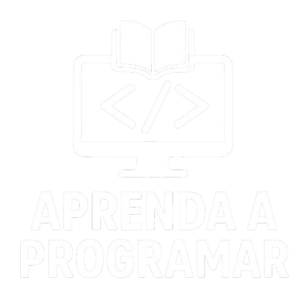

  
  <h1 align="center">Aprenda a Programar de Graça</h1>

## :dart: Seu guia gratuito para começar na tecnologia

Aqui você encontra conteúdos gratuitos para aprender programação e outras áreas da tecnologia, do básico ao avançado. Nosso objetivo é ajudar você a construir sua carreira na área de TI, expandir seus conhecimentos e dominar novas ferramentas e linguagens. Todos os materiais são gratuitos, com foco em tornar seu aprendizado acessível e prático.

## ⚠️ Aviso importante

> Antes de tudo, você pode contribuir para manter este repositório sempre organizado e útil para quem está estudando ou trabalhando na área.

- Me siga no [Github](https://github.com/wellingtonsoaresdevv)
- Curtiu o conteúdo? Está sendo útil para os seus estudos? Então, dá aquela forcinha e deixa uma Star no repositório! ⭐

## 💡 Nossa proposta

> A proposta deste repositório é disponibilizar conteúdos gratuitos para apoiar seus estudos em tecnologia e programação, ajudando você a entender qual pode ser o próximo passo da sua jornada de aprendizado — sem se perder em modas passageiras ou “hypes” do momento.

> Acreditamos que, com um conhecimento mais amplo sobre linguagens, ferramentas e diferentes áreas da TI, você poderá fazer escolhas mais inteligentes sobre quais tecnologias fazem sentido para o seu futuro profissional.

> Lembre-se: seguir tendências pode ser interessante, mas sólidos fundamentos sempre serão seu maior diferencial.

## :beginner: Para quem está começando agora

> Se você está dando os primeiros passos na programação ou na área de tecnologia, recomendamos começar pelos fundamentos. Eles serão a base para qualquer linguagem ou especialização que você escolher no futuro. Entender como a programação funciona, ganhar confiança e criar seus primeiros projetos simples! :punch:

## 🚨 Colabore 

- Abra Pull Requests com atualizações
- Discuta ideias em Issues
- Compartilhe o repositório com a sua comunidade
- Envie links e sites gratuitos ensinando qualquer linguagem.

## 📚 ÍNDICE

[💻 Máquinas Virtuais](#-máquinas-virtuais)  
[🦉 Sites e cursos para aprender C](#-sites-e-cursos-para-aprender-c)  
[🐬 Sites e cursos para aprender Go](#-sites-e-cursos-para-aprender-go)  
[🦚 Sites e cursos para aprender C#](#-sites-e-cursos-para-aprender-c-1)  
[🐸 Sites e cursos para aprender C++](#-sites-e-cursos-para-aprender-c-2)  
[🐘 Sites e cursos para aprender PHP](#-sites-e-cursos-para-aprender-php)  
[🦓 Sites e cursos para aprender Java](#-sites-e-cursos-para-aprender-java)  
[🐦 Sites e cursos para aprender Ruby](#-sites-e-cursos-para-aprender-ruby)  
[🐪 Sites e cursos para aprender Perl](#-sites-e-cursos-para-aprender-perl)  
[🐷 Sites e cursos para aprender Bash](#-sites-e-cursos-para-aprender-bash)  
[🐴 Sites e cursos para aprender MySQL](#-sites-e-cursos-para-aprender-mysql)  
[🐧 Sites e cursos para aprender Linux](#-sites-e-cursos-para-aprender-linux)  
[🦂 Sites e cursos para aprender Swift](#-sites-e-cursos-para-aprender-swift)  
[🐍 Sites e cursos para aprender Python](#-sites-e-cursos-para-aprender-python)  
[🐋 Sites e cursos para aprender Docker](#-sites-e-cursos-para-aprender-docker)  
[🐼 Sites e cursos para aprender Assembly](#-sites-e-cursos-para-aprender-assembly)  
[🦞 Sites e cursos para aprender Powershell](#-sites-e-cursos-para-aprender-powershell)  

## 💻 Máquinas Virtuais

- [Oracle VM VirtualBox](https://www.virtualbox.org/)
- [VMware Workstation](https://www.vmware.com/br/products/workstation-player/workstation-player-evaluation.html)
- [VMware Workstation Player](https://www.vmware.com/products/workstation-player.html)
- [VMware Fusion](https://www.vmware.com/br/products/fusion.html)
- [Vagrant](https://www.vagrantup.com/)

## 🦉 Sites e cursos para aprender C

> Cursos para aprender C em Português 
- [Curso de C - eXcript](https://www.youtube.com/playlist?list=PLesCEcYj003SwVdufCQM5FIbrOd0GG1M4)
- [Programação Moderna em C - Papo Binário](https://www.youtube.com/playlist?list=PLIfZMtpPYFP5qaS2RFQxcNVkmJLGQwyKE)
- [Curso de Linguagem C - Pietro Martins](https://www.youtube.com/playlist?list=PLpaKFn4Q4GMOBAeqC1S5_Fna_Y5XaOQS2)
- [Curso de Programação C Completo - Programe seu futuro](https://www.youtube.com/playlist?list=PLqJK4Oyr5WSjjEQCKkX6oXFORZX7ro3DA)
- [Linguagem C - De aluno para aluno](https://www.youtube.com/playlist?list=PLa75BYTPDNKZWYypgOFEsX3H2Mg-SzuLW)
- [Curso de Linguagem C para Iniciantes - John Haste](https://www.youtube.com/playlist?list=PLGgRtySq3SDMLV8ee7p-rA9y032AU3zT8)
- [Curso de Linguagem C (ANSI)](https://www.youtube.com/playlist?list=PLZ8dBTV2_5HTGGtrPxDB7zx8J5VMuXdob)
- [Curso - Programação com a Linguagem C para iniciantes](https://www.youtube.com/playlist?list=PLbEOwbQR9lqxHno2S-IiG9-lePyRNOO_E)
- [Curso de Programação 3 (C Avançado)](https://www.youtube.com/playlist?list=PLxMw67OGLa0kW_TeweK2-9gXRlMLYzC1o)
- [Curso de C - Diego Moisset](https://www.youtube.com/playlist?list=PLIygiKpYTC_6zHLTjI6cFIRZm1BCT3CuV)
- [Curso de C e C++](https://www.youtube.com/playlist?list=PL5EmR7zuTn_bONyjFxSO4ZCE-SVVNFGkS)
- [Curso de Programação em Linguagem C](https://www.youtube.com/playlist?list=PLucm8g_ezqNqzH7SM0XNjsp25AP0MN82R)
- [Linguagem C - Curso de Programação Completo para Iniciantes e Profissionais](https://www.youtube.com/playlist?list=PLrqNiweLEMonijPwsHckWX7fVbgT2jS3P)
- [Curso de Lógica e programação em C](https://www.youtube.com/playlist?list=PLtnFngjANe7EMzARU48QgecpyQdzWapoT)

> Cursos para aprender C em Inglês
- [C Programming for Beginners](https://www.youtube.com/playlist?list=PL98qAXLA6aftD9ZlnjpLhdQAOFI8xIB6e)
- [C Programming - Neso Academy](https://www.youtube.com/playlist?list=PLBlnK6fEyqRggZZgYpPMUxdY1CYkZtARR)
- [C Programming & Data Structures](https://www.youtube.com/playlist?list=PLBlnK6fEyqRhX6r2uhhlubuF5QextdCSM)
- [Programming in C - Jennys](https://www.youtube.com/playlist?list=PLdo5W4Nhv31a8UcMN9-35ghv8qyFWD9_S)
- [C Language Tutorials In Hindi](https://www.youtube.com/playlist?list=PLu0W_9lII9aiXlHcLx-mDH1Qul38wD3aR)
- [freeCodeCamp C / C++](https://www.youtube.com/playlist?list=PLWKjhJtqVAbmUE5IqyfGYEYjrZBYzaT4m)
- [C Programming Tutorials](https://www.youtube.com/playlist?list=PL_c9BZzLwBRKKqOc9TJz1pP0ASrxLMtp2)
- [C Language Tutorial Videos - Mr. Srinivas](https://www.youtube.com/playlist?list=PLVlQHNRLflP8IGz6OXwlV_lgHgc72aXlh)
- [Advanced C Programming](https://www.youtube.com/playlist?list=PL7CZ_Xc0qgmJFqNWEt4LIhAPTlT0sCW4C)
- [Free Online Programming Course in C for Beginners](https://www.youtube.com/playlist?list=PL76809ED684A081F3)
- [C Programming - Ankpro](https://www.youtube.com/playlist?list=PLUtTaqnx2RJLSUZgv0zp0aNWy9e1cbKd9)
- [C Programming Tutorials - The New Boston](https://www.youtube.com/playlist?list=PL6gx4Cwl9DGAKIXv8Yr6nhGJ9Vlcjyymq)
- [C Programming - IntelliPaat](https://www.youtube.com/playlist?list=PLVHgQku8Z935hrZwx751XoyqDROH_tYMY)
- [Learn C programming - edureka!](https://www.youtube.com/playlist?list=PL9ooVrP1hQOFrNo8jK9Yb2g2eMHz7hTu9)
- [C Programming Tutorials - Saurabh Shukla](https://www.youtube.com/playlist?list=PLe_7x5eaUqtWp9fvsxhC4XIkoR3n5A-sF)

## 🐬 Sites e cursos para aprender Go

> Sites para aprender Go
- [Onde aprender e estudar GoLang?](https://coodesh.com/blog/candidates/backend/onde-aprender-e-estudar-golang/#:~:text=%E2%8C%A8%EF%B8%8F%20Udemy,11%2C5%20horas%20de%20videoaula.)
- [Go Lang - School Of Net](https://www.schoolofnet.com/cursos/programacao/go-lang/)
- [48 horas para aprender Go](https://medium.com/@anapaulagomes/48-horas-para-aprender-go-4542b51d84a4)
- [Estudo em GoLang: from Zero to Hero com materiais gratuitos!](https://medium.com/hurb-labs/estudo-em-golang-from-zero-to-hero-com-materiais-gratuitos-6be72aeea30f)

> Cursos para aprender Go em Português 
- [Aprenda Go](https://www.youtube.com/playlist?list=PLCKpcjBB_VlBsxJ9IseNxFllf-UFEXOdg)
- [Aprenda Go / Golang (Curso Tutorial de Programação)](https://www.youtube.com/playlist?list=PLUbb2i4BuuzCX8CLeArvx663_0a_hSguW)
- [Go Lang do Zero](https://www.youtube.com/playlist?list=PL5aY_NrL1rjucQqO21QH8KclsLDYu1BIg)
- [Curso de Introdução a Linguagem Go (Golang)](https://www.youtube.com/playlist?list=PLXFk6ROPeWoAvLMyJ_PPfu8oF0-N_NgEI)
- [Curso Programação Golang](https://www.youtube.com/playlist?list=PLpZslZJHL2Q2hZXShelGADqCR_fcOhF9K)

> Cursos para aprender Go em Espanhol
- [Curso de Go (Golang)](https://www.youtube.com/playlist?list=PLt1J5u9LpM5-L-Ps8jjr91pKhFxAnxKJp)
- [Aprendiendo a programar con Go](https://www.youtube.com/playlist?list=PLSAQnrUqbx7sOdjJ5Zsq5FvvYtI8Kc-C5)
- [Curso Go - de 0 a 100](https://www.youtube.com/playlist?list=PLhdY0D_lA34W1wS2nJmQr-sssMDuQf-r8)
- [Curso Go - CodigoFacilito](https://www.youtube.com/playlist?list=PLdKnuzc4h6gFmPLeous4S0xn0j9Ik2s3Y)
- [Curso GO (Golang Español) - De 0 a 100](https://www.youtube.com/playlist?list=PLl_hIu4u7P64MEJpR3eVwQ1l_FtJq4a5g)
- [Curso de Golang para principiante](https://www.youtube.com/playlist?list=PLm28buT4PAtbsurufxiw9k2asnkin4YLd)

> Cursos para aprender Go em Inglês
- [Golang Tutorial for Beginners | Full Go Course](https://www.youtube.com/watch?v=yyUHQIec83I&ab_channel=TechWorldwithNana)
- [Learn Go Programming - Golang Tutorial for Beginners](https://www.youtube.com/watch?v=YS4e4q9oBaU&ab_channel=freeCodeCamp.org)
- [Backend master class [Golang, Postgres, Docker]](https://www.youtube.com/playlist?list=PLy_6D98if3ULEtXtNSY_2qN21VCKgoQAE)
- [Let's go with golang](https://www.youtube.com/playlist?list=PLRAV69dS1uWQGDQoBYMZWKjzuhCaOnBpa)
- [Go Programming Language Tutorial | Golang Tutorial For Beginners | Go Language Training](https://www.youtube.com/playlist?list=PLS1QulWo1RIaRoN4vQQCYHWDuubEU8Vij)
- [Golang Tutorials](https://www.youtube.com/playlist?list=PLzMcBGfZo4-mtY_SE3HuzQJzuj4VlUG0q)
- [Golang course - Duomly](https://www.youtube.com/playlist?list=PLi21Ag9n6jJJ5bq77cLYpCgOaONcQNqm0)
- [Golang Course - Evhenii Kozlov](https://www.youtube.com/playlist?list=PLgUAJTkYL6T_-PXWgVFGTkz863zZ_1do0)
- [Golang Development](https://www.youtube.com/playlist?list=PLzUGFf4GhXBL4GHXVcMMvzgtO8-WEJIoY)
- [Golang Crash Course](https://www.youtube.com/playlist?list=PL3eAkoh7fypqUQUQPn-bXtfiYT_ZSVKmB)
- [Golang Course From A to Z - 5 Hours of Video](https://www.youtube.com/playlist?list=PLuMFwYAgU7ii-z4TGGqXh1cJt-Dqnk2eY)

## 🦚 Sites e cursos para aprender C#

> Cursos para aprender C# em Português 
- [Curso de C# - Aprenda o essencial em 5 HORAS](https://www.youtube.com/watch?v=PKMm-cHe56g&ab_channel=VictorLima-GuiadoProgramador)
- [Curso de Programação C#](https://www.youtube.com/playlist?list=PLx4x_zx8csUglgKTmgfVFEhWWBQCasNGi)
- [Curso C# 2021](https://www.youtube.com/playlist?list=PL50rZONmv8ZTLPRyqb37EoPlBpSmVBJWX)
- [Curso de C# para Iniciantes](https://www.youtube.com/playlist?list=PLwftZeDnOzt3VMtat5BTJvP_7qgNtRDD8)
- [Linguagem C#](https://www.youtube.com/playlist?list=PLEdPHGYbHhlcxWx-_LrVVYZ2RRdqltums)
- [C# - De Novato a Profissional](https://www.youtube.com/playlist?list=PLXik_5Br-zO-rMqpRy5qPG2SLNimKmVCO)
- [Curso de C#](https://www.youtube.com/playlist?list=PLesCEcYj003SFffgnOcITHnCJavMf0ArD)
- [Curso de C# - Pildoras Informaticas](https://www.youtube.com/playlist?list=PLU8oAlHdN5BmpIQGDSHo5e1r4ZYWQ8m4B)
- [Curso de C# Básico e Avançado](https://www.youtube.com/playlist?list=PLxNM4ef1BpxgRAa5mGXlCoSGyfYau8nZI)
- [Curso de Programação em C#](https://www.youtube.com/playlist?list=PLO_xIfla8f1wDmI0Vd4YJLKBJhOeQ3xbz)
- [Curso de Programação com C#](https://www.youtube.com/playlist?list=PLucm8g_ezqNoMPIGWbRJXemJKyoUpTjA1)
- [Curso Básico de C#](https://www.youtube.com/playlist?list=PL0YuSuacUEWsHR_a22z31bvA2heh7iUgr)
- [Curso de Desenvolvimento de Sistemas - C# com SQL](https://www.youtube.com/playlist?list=PLxNM4ef1BpxjLIq-eTL8mgROdviCiobs9)
- [Curso de C# - Diego Moisset](https://www.youtube.com/playlist?list=PLIygiKpYTC_400MCSyUlje1ifmFltonuN)
- [C# - Programação Orientada a Objetos](https://www.youtube.com/playlist?list=PLfvOpw8k80Wreysmw8fonLCBw8kiiYjIU)
- [Curso .NET Core C#](https://www.youtube.com/playlist?list=PLs3yd28pfby7WLEdA7GXey47cKZKMrcwS)
- [Curso de C# com Entity - CSharp com SQL](https://www.youtube.com/playlist?list=PLxNM4ef1BpxgIUUueLguueyhx0UuICC3-)
- [Curso de C# com MVC e SQL](https://www.youtube.com/playlist?list=PLxNM4ef1Bpxgilp2iFXI4i2if6Qtg6qFZ)

> Cursos para aprender C# em Espanhol
- [Curso C# de 0 a Experto](https://www.youtube.com/playlist?list=PLvMLybJwXhLEVUlBI2VdmYXPARO2Zwxze)
- [Tutorial C# - Curso básico](https://www.youtube.com/playlist?list=PLM-p96nOrGcakia6TWllPW9lkQmB2g-yX)
- [Aprende a programar en C# desde CERO](https://www.youtube.com/playlist?list=PL8gxzfBmzgexdFa0XZZSZZn2Ogx3j-Qd5)

> Cursos para aprender C# em Inglês
- [C# Tutorial - Full Course for Beginners](https://www.youtube.com/watch?v=GhQdlIFylQ8&ab_channel=freeCodeCamp.org)
- [C# Full Course - Learn C# 10 and .NET 6 in 7 hours](https://www.youtube.com/watch?v=q_F4PyW8GTg&ab_channel=tutorialsEU)
- [C# Tutorial: Full Course for Beginners](https://www.youtube.com/watch?v=wxznTygnRfQ&ab_channel=BroCode)
- [C# Fundamentals for Beginners](https://www.youtube.com/watch?v=0QUgvfuKvWU&ab_channel=MicrosoftDeveloper)
- [C# Tutorial For Beginners - Learn C# Basics in 1 Hour](https://www.youtube.com/watch?v=gfkTfcpWqAY&ab_channel=ProgrammingwithMosh)
- [C# for Beginners | Full 2-hour course](https://www.youtube.com/watch?v=Z5JS36NlJiU&ab_channel=dotnet)
- [C# Programming All-in-One Tutorial Series (6 HOURS!)](https://www.youtube.com/watch?v=qOruiBrXlAw&ab_channel=CalebCurry)
- [Create a C# Application from Start to Finish - Complete Course](https://www.youtube.com/watch?v=wfWxdh-_k_4&ab_channel=freeCodeCamp.org)
- [C# Tutorials](https://www.youtube.com/playlist?list=PL_c9BZzLwBRIXCJGLd4UzqH34uCclOFwC)
- [C# Mastery Course](https://www.youtube.com/playlist?list=PLrW43fNmjaQVSmaezCeU-Hm4sMs2uKzYN)
- [C# Full Course Beginner to Advanced](https://www.youtube.com/playlist?list=PLq5Uz3LSFff8GmtFeoXRZCtWBKQ0kWl-H)
- [C# Tutorial For Beginners & Basics - Full Course 2022](https://www.youtube.com/playlist?list=PL82C6-O4XrHfoN_Y4MwGvJz5BntiL0z0D)
- [C# for Beginners Course](https://www.youtube.com/playlist?list=PL4LFuHwItvKbneXxSutjeyz6i1w32K6di)
- [C# tutorial for beginners](https://www.youtube.com/playlist?list=PLAC325451207E3105)
- [C# Online Training](https://www.youtube.com/playlist?list=PLWPirh4EWFpFYePpf3E3AI8LT4NInNoIM)
- [C# Training](https://www.youtube.com/playlist?list=PLEiEAq2VkUULDJ9tZd3lc0rcH4W5SNSoW)
- [C# for Beginners](https://www.youtube.com/playlist?list=PLdo4fOcmZ0oVxKLQCHpiUWun7vlJJvUiN)
- [C# - Programming Language | Tutorial](https://www.youtube.com/playlist?list=PLLAZ4kZ9dFpNIBTYHNDrhfE9C-imUXCmk)
- [C#.NET Tutorials](https://www.youtube.com/playlist?list=PLTjRvDozrdlz3_FPXwb6lX_HoGXa09Yef)

## 🐸 Sites e cursos para aprender C++

> Cursos para aprender C++ em Português 
- [Curso C++ - eXcript](https://www.youtube.com/playlist?list=PLesCEcYj003QTw6OhCOFb1Fdl8Uiqyrqo)
- [Curso de C e C++ - Daves Tecnologia](https://www.youtube.com/playlist?list=PL5EmR7zuTn_bONyjFxSO4ZCE-SVVNFGkS)
- [Curso Programação em C/C++](https://www.youtube.com/playlist?list=PLC9E87254BD7A875B)
- [Curso C++ para iniciantes](https://www.youtube.com/playlist?list=PL8eBmR3QtPL13Dkn5eEfmG9TmzPpTp0cV)
- [Curso de C++ e C#](https://www.youtube.com/playlist?list=PLxNM4ef1Bpxhro_xZd-PCUDUsgg8tZFKh)
- [Curso C++](https://www.youtube.com/playlist?list=PL6xP0t6HQYWcUPcXLu2XTZ3gOCJSmolgO)
- [Curso de C++ - A linguagem de programação fundamental para quem quer ser um programador](https://www.youtube.com/playlist?list=PLx4x_zx8csUjczg1qPHavU1vw1IkBcm40)

> Cursos para aprender C++ em Espanhol
- [Programación en C++](https://www.youtube.com/playlist?list=PLWtYZ2ejMVJlUu1rEHLC0i_oibctkl0Vh)
- [Curso en C++ para principiantes](https://www.youtube.com/playlist?list=PLDfQIFbmwhreSt6Rl2PbDpGuAEqOIPmEu)
- [C++ desde cero](https://www.youtube.com/playlist?list=PLAzlSdU-KYwWsM0FgOs4Jqwnr5zhHs0wU)
- [Curso de Interfaces Graficas en C/C++](https://www.youtube.com/playlist?list=PLYA44wBp7zVTiCJiXIC5H5OkMOXptxLOI)

> Cursos para aprender C++ em Inglês
- [C++ Programming Course - Beginner to Advanced 31 hours](https://www.youtube.com/watch?v=8jLOx1hD3_o&ab_channel=freeCodeCamp.org) 
- [C++ Full Course For Beginners (Learn C++ in 10 hours)](https://www.youtube.com/watch?v=GQp1zzTwrIg&ab_channel=CodeBeauty) 
- [C++ Tutorial for Beginners - Learn C++ in 1 Hour](https://www.youtube.com/watch?v=ZzaPdXTrSb8&ab_channel=ProgrammingwithMosh) 
- [C++ Tutorial: Full Course for Beginners](https://www.youtube.com/watch?v=-TkoO8Z07hI&ab_channel=BroCode) 
- [C++ Tutorial for Beginners - Complete Course](https://www.youtube.com/watch?v=vLnPwxZdW4Y&ab_channel=freeCodeCamp.org) 
- [C++ Programming All-in-One Tutorial Series (10 HOURS!)](https://www.youtube.com/watch?v=_bYFu9mBnr4&ab_channel=CalebCurry) 
- [C++ Full Course 2022](https://www.youtube.com/watch?v=SYd5F4gIH90&ab_channel=Simplilearn) 
- [C++ Crash Course](https://www.youtube.com/watch?v=uhFpPlMsLzY&ab_channel=BroCode) 
- [C++ - The Cherno](https://www.youtube.com/playlist?list=PLlrATfBNZ98dudnM48yfGUldqGD0S4FFb) 
- [C++ Full Course | C++ Tutorial | Data Structures & Algorithms](https://www.youtube.com/playlist?list=PLfqMhTWNBTe0b2nM6JHVCnAkhQRGiZMSJ) 
- [C++ Programming - Neso Academy](https://www.youtube.com/playlist?list=PLBlnK6fEyqRh6isJ01MBnbNpV3ZsktSyS) 
- [C++ Complete Course](https://www.youtube.com/playlist?list=PLdo5W4Nhv31YU5Wx1dopka58teWP9aCee) 
- [C++ Tutorials In Hindi](https://www.youtube.com/playlist?list=PLu0W_9lII9agpFUAlPFe_VNSlXW5uE0YL) 
- [C++ Online Training](https://www.youtube.com/playlist?list=PLWPirh4EWFpGDG3--IKMLPoYrgfuhaz_t) 
- [C / C++ - freeCodeCamp Playlist](https://www.youtube.com/playlist?list=PLWKjhJtqVAbmUE5IqyfGYEYjrZBYzaT4m) 
- [C++ Modern Tutorials](https://www.youtube.com/playlist?list=PLgnQpQtFTOGRM59sr3nSL8BmeMZR9GCIA) 

## 🐘 Sites e cursos para aprender PHP

> Cursos para aprender PHP em Português 
- [Curso de PHP para Iniciantes](https://www.youtube.com/playlist?list=PLHz_AreHm4dm4beCCCmW4xwpmLf6EHY9k)
- [Curso de PHP - Node Studio](https://www.youtube.com/playlist?list=PLwXQLZ3FdTVEITn849NlfI9BGY-hk1wkq)
- [Curso de PHP - CFBCursos](https://www.youtube.com/playlist?list=PLx4x_zx8csUgB4R1dDXke4uKMq-IrSr4B)
- [Curso de PHP 8 Completo](https://www.youtube.com/playlist?list=PLXik_5Br-zO9wODVI0j58VuZXkITMf7gZ)
- [Curso de PHP - eXcript](https://www.youtube.com/playlist?list=PLesCEcYj003TrV2MvUOnmVtMdgIp0C4Pd)
- [Curso de PHP Orientado a Objetos](https://www.youtube.com/playlist?list=PLwXQLZ3FdTVEau55kNj_zLgpXL4JZUg8I)
- [Curso de PHP8 Completo - Intermédio e Avançado](https://www.youtube.com/playlist?list=PLXik_5Br-zO9Z8l3CE8zaIBkVWjHOboeL)
- [Curso de PHP](https://www.youtube.com/playlist?list=PLBFB56E8115533B6C)
- [Curso de POO PHP (Programação Orientada a Objetos)](https://www.youtube.com/playlist?list=PLHz_AreHm4dmGuLII3tsvryMMD7VgcT7x)
- [Curso de PHP 7 Orientado a Objetos](https://www.youtube.com/playlist?list=PLnex8IkmReXz6t1rqxB-W17dbvfSL1vfg)
- [Curso de PHP 7](https://www.youtube.com/playlist?list=PLnex8IkmReXw-QlzKS9zA3rXQsRnK5nnA)
- [Curso de PHP com MySQL](https://www.youtube.com/playlist?list=PLucm8g_ezqNrkPSrXiYgGXXkK4x245cvV)
- [Curso de PHP para iniciantes](https://www.youtube.com/playlist?list=PLInBAd9OZCzx82Bov1cuo_sZI2Lrb7mXr)
- [Curso de PHP 7 e MVC - Micro Framework](https://www.youtube.com/playlist?list=PL0N5TAOhX5E-NZ0RRHa2tet6NCf9-7B5G)
- [Curso de PHP - Emerson Carvalho](https://www.youtube.com/playlist?list=PLIZ0d6lKIbVpOxc0x1c4HpEWyK0JMsL49)

> Cursos para aprender PHP em Espanhol
- [Curso de PHP/MySQL](https://www.youtube.com/playlist?list=PLU8oAlHdN5BkinrODGXToK9oPAlnJxmW_)
- [Curso completo de PHP desde cero a experto](https://www.youtube.com/playlist?list=PLH_tVOsiVGzmnl7ImSmhIw5qb9Sy5KJRE)
- [Curso PHP 8 y MySQL 8 desde cero](https://www.youtube.com/playlist?list=PLZ2ovOgdI-kUSqWuyoGJMZL6xldXw6hIg)
- [Curso de PHP completo desde cero](https://www.youtube.com/playlist?list=PLg9145ptuAij8vIQLU25f7sUSH4E8pdY5)
- [Curso completo PHP y MySQL principiantes-avanzado](https://www.youtube.com/playlist?list=PLvRPaExkZHFkpBXXCsL2cn9ORTTcPq4d7)
- [Curso PHP Básico](https://www.youtube.com/playlist?list=PL469D93BF3AE1F84F)
- [PHP desde cero](https://www.youtube.com/playlist?list=PLAzlSdU-KYwW9eWj88DW55gTi1M5HQo5S)

> Cursos para aprender PHP em Inglês
- [Learn PHP The Right Way - Full PHP Tutorial For Beginners & Advanced](https://www.youtube.com/playlist?list=PLr3d3QYzkw2xabQRUpcZ_IBk9W50M9pe-)
- [PHP Programming Language Tutorial - Full Course](https://www.youtube.com/watch?v=OK_JCtrrv-c&ab_channel=freeCodeCamp.org)
- [PHP For Absolute Beginners | 6.5 Hour Course](https://www.youtube.com/watch?v=2eebptXfEvw&ab_channel=TraversyMedia)
- [PHP For Beginners | 3+ Hour Crash Course](https://www.youtube.com/watch?v=BUCiSSyIGGU&ab_channel=TraversyMedia)
- [PHP Tutorial for Beginners - Full Course | OVER 7 HOURS!](https://www.youtube.com/watch?v=t0syDUSbdfE&ab_channel=EnvatoTuts%2B)
- [PHP And MySQL Full Course in 2022](https://www.youtube.com/watch?v=s-iza7kAXME&ab_channel=Simplilearn)
- [PHP Full Course | PHP Tutorial For Beginners](https://www.youtube.com/watch?v=6EukZDFE_Zg&ab_channel=Simplilearn)
- [PHP Front To Back](https://www.youtube.com/playlist?list=PLillGF-Rfqbap2IB6ZS4BBBcYPagAjpjn)
- [PHP Tutorial for Beginners](https://www.youtube.com/playlist?list=PL4cUxeGkcC9gksOX3Kd9KPo-O68ncT05o)
- [PHP for beginners](https://www.youtube.com/playlist?list=PLFHz2csJcgk_fFEWydZJLiXpc9nB1qfpi)
- [The Complete 2021 PHP Full Stack Web Developer](https://www.youtube.com/playlist?list=PLs-hN447lej6LvquSMoWkGlJAJrhwaVNX)
- [PHP Training Videos](https://www.youtube.com/playlist?list=PLEiEAq2VkUUIjP-QLfvICa1TvqTLFvn1b)
- [PHP complete course with Project](https://www.youtube.com/playlist?list=PLFINWHSIpuivHWnGE8YGw8uFygThFGr3-)
- [PHP Course for Beginners](https://www.youtube.com/playlist?list=PLLQuc_7jk__WTMT4U1qhDkhqd2bOAdxSo)
- [PHP Tutorials Playlist](https://www.youtube.com/playlist?list=PL442FA2C127377F07)
- [PHP Tutorials](https://www.youtube.com/playlist?list=PL0eyrZgxdwhwBToawjm9faF1ixePexft-)
- [PHP Tutorial for Beginners](https://www.youtube.com/playlist?list=PLS1QulWo1RIZc4GM_E04HCPEd_xpcaQgg)
- [PHP 7 Course - From Zero to Hero](https://www.youtube.com/playlist?list=PLCwJ-zYcMM92IlmUrW7Nn79y4LHGfODGc)
- [PHP Tutorials (updated)](https://www.youtube.com/playlist?list=PL0eyrZgxdwhxhsuT_QAqfi-NNVAlV4WIP)
- [PHP & MySQL Tutorial Videos](https://www.youtube.com/playlist?list=PL9ooVrP1hQOFB2yjxFbK-Za8HwM5v1NC5)
- [PHP from intermediate to advanced](https://www.youtube.com/playlist?list=PLBEpR3pmwCazOsFp0xI3keBq7SoqDnxM7)
- [Object Oriented PHP Tutorials](https://www.youtube.com/playlist?list=PL0eyrZgxdwhypQiZnYXM7z7-OTkcMgGPh)
- [PHP OOP Basics Full Course](https://www.youtube.com/playlist?list=PLY3j36HMSHNUfTDnDbW6JI06IrkkdWCnk)
- [Advanced PHP](https://www.youtube.com/playlist?list=PLu4-mSyb4l4SlKcO51aLtyiuOmlEuojvZ)

## 🦓 Sites e cursos para aprender Java

> Cursos para aprender Java em Português 
- [Maratona Java Virado no Jiraya](https://www.youtube.com/playlist?list=PL62G310vn6nFIsOCC0H-C2infYgwm8SWW)
- [Curso de Java para Iniciantes - Grátis, Completo e com Certificado](https://www.youtube.com/playlist?list=PLHz_AreHm4dkI2ZdjTwZA4mPMxWTfNSpR)
- [Curso de Java - Tiago Aguiar](https://www.youtube.com/playlist?list=PLJ0AcghBBWSi6nK2CUkw9ngvwWB1gE8mL)
- [Curso de Java - CFBCursos](https://www.youtube.com/playlist?list=PLx4x_zx8csUjFC5WWjoNUL7LOOD7LCKRW)
- [Maratona Java - O maior curso Java em português](https://www.youtube.com/playlist?list=PL62G310vn6nHrMr1tFLNOYP_c73m6nAzL)
- [Curso de Java Básico Gratuito com Certificado](https://www.youtube.com/playlist?list=PLGxZ4Rq3BOBq0KXHsp5J3PxyFaBIXVs3r)
- [Curso de Java - eXcript](https://www.youtube.com/playlist?list=PLesCEcYj003Rfzs39Y4Bs_chpkE276-gD)
- [Curso de POO Java (Programação Orientada a Objetos)](https://www.youtube.com/playlist?list=PLHz_AreHm4dkqe2aR0tQK74m8SFe-aGsY)
- [Curso de Programação em Java](https://www.youtube.com/playlist?list=PLucm8g_ezqNrQmqtO0qmew8sKXEEcaHvc)
- [Curso - Fundamentos da Linguagem Java](https://www.youtube.com/playlist?list=PLbEOwbQR9lqxdW98mY-40IZQ5i8ZZyeQx)
- [Curso Java Estruturado](https://www.youtube.com/playlist?list=PLGPluF_nhP9p6zWTN88ZJ1q9J_ZK148-f)
- [Curso de Java Completo](https://www.youtube.com/playlist?list=PL6vjf6t3oYOrSx2XQKm3yvNxgjtI1A56P)
- [Curso Programação Java](https://www.youtube.com/playlist?list=PLtchvIBq_CRTAwq_xmHdITro_5vbyOvVw)
- [Curso de Java para Iniciantes](https://www.youtube.com/playlist?list=PLt2CbMyJxu8iQL67Am38O1j5wKLf0AIRZ)

> Cursos para aprender Java em Espanhol
- [Curso de Java desde 0](https://www.youtube.com/playlist?list=PLU8oAlHdN5BktAXdEVCLUYzvDyqRQJ2lk)
- [Curso de programación Java desde cero](https://www.youtube.com/playlist?list=PLyvsggKtwbLX9LrDnl1-K6QtYo7m0yXWB)
- [Curso de Java Completo 2021](https://www.youtube.com/playlist?list=PLt1J5u9LpM59sjPZFl3KYUhTrpwPIhKor)
- [Java Netbeans Completo](https://www.youtube.com/playlist?list=PLCTD_CpMeEKTT-qEHGqZH3fkBgXH4GOTF)
- [Programación en Java](https://www.youtube.com/playlist?list=PLWtYZ2ejMVJkjOuTCzIk61j7XKfpIR74K)
- [Curso de Java 11](https://www.youtube.com/playlist?list=PLf5ldD20p3mHRM3O4yUongNYx6UaELABm)
- [Curso de Java - Jesús Conde](https://www.youtube.com/playlist?list=PL4D956E5314B9C253)
- [Curso de programacion funcional en java](https://www.youtube.com/playlist?list=PLjJ8HhsSfskiDEwgfyF9EznmrSyEukcJa)

> Cursos para aprender Java em Inglês
- [Java Tutorial for Beginners](https://www.youtube.com/watch?v=eIrMbAQSU34&ab_channel=ProgrammingwithMosh)
- [Java Tutorial: Full Course for Beginners](https://www.youtube.com/watch?v=xk4_1vDrzzo&ab_channel=BroCode)
- [Java Full Course](https://www.youtube.com/watch?v=Qgl81fPcLc8&ab_channel=Amigoscode)
- [Java Programming for Beginners – Full Course](https://www.youtube.com/watch?v=A74TOX803D0&ab_channel=freeCodeCamp.org)
- [Intro to Java Programming - Course for Absolute Beginners](https://www.youtube.com/watch?v=GoXwIVyNvX0&ab_channel=freeCodeCamp.org)
- [Learn Java 8 - Full Tutorial for Beginners](https://www.youtube.com/watch?v=grEKMHGYyns&ab_channel=freeCodeCamp.org)
- [Java Full Course 2022 | Java Tutorial For Beginners | Core Java Full Course](https://www.youtube.com/watch?v=CFD9EFcNZTQ&ab_channel=Simplilearn)
- [Java Full Course for Beginners](https://www.youtube.com/watch?v=_3ds4qujpxU&ab_channel=SDET-QAAutomation)
- [Java Full Course | Java Tutorial for Beginners](https://www.youtube.com/watch?v=hBh_CC5y8-s&ab_channel=edureka%21)
- [Learn JavaScript in 12 Hours | JavaScript Tutorial For Beginners 2022](https://www.youtube.com/watch?v=A1eszacPf-4&ab_channel=Simplilearn)
- [Java GUI: Full Course](https://www.youtube.com/watch?v=Kmgo00avvEw&ab_channel=BroCode)
- [Java Collections Framework | Full Course](https://www.youtube.com/watch?v=GdAon80-0KA&ab_channel=JavaGuides)
- [Java Programming](https://www.youtube.com/playlist?list=PLBlnK6fEyqRjKA_NuK9mHmlk0dZzuP1P5)
- [Java Complete Course | Placement Series](https://www.youtube.com/playlist?list=PLfqMhTWNBTe3LtFWcvwpqTkUSlB32kJop)
- [Stanford - Java course](https://www.youtube.com/playlist?list=PLA70DBE71B0C3B142)
- [Java Tutorials](https://www.youtube.com/playlist?list=PL_c9BZzLwBRKIMP_xNTJxi9lIgQhE51rF)
- [Java Full Course - 2022 | Java Tutorial for Beginners](https://www.youtube.com/playlist?list=PL9ooVrP1hQOEe9EN119lMdwcBxcrBI1D3)
- [Java (Intermediate) Tutorials](https://www.youtube.com/playlist?list=PL27BCE863B6A864E3)
- [Core Java (Full Course)](https://www.youtube.com/playlist?list=PLsjUcU8CQXGFZ7xMUxJBE33FWWykEWm49)
- [Working Class Java Programming & Software Architecture Fundamentals Course](https://www.youtube.com/playlist?list=PLEVlop6sMHCoVFZ8nc_HmXOi8Msrah782)
- [Java Programming Tutorials for Beginners [Complete Course]](https://www.youtube.com/playlist?list=PLIY8eNdw5tW_uaJgi-FL9QwINS9JxKKg2)
- [Java Tutorials For Beginners In Hindi](https://www.youtube.com/playlist?list=PLu0W_9lII9agS67Uits0UnJyrYiXhDS6q)
- [Java Tutorial For Beginners](https://www.youtube.com/playlist?list=PLsyeobzWxl7oZ-fxDYkOToURHhMuWD1BK)
- [Java Tutorial for Beginners - Bro Code](https://www.youtube.com/playlist?list=PLZPZq0r_RZOMhCAyywfnYLlrjiVOkdAI1)
- [Java Programming Tutorial](https://www.youtube.com/playlist?list=PLsyeobzWxl7pFZoGT1NbZJpywedeyzyaf)
- [Java (Beginner) Programming Tutorials](https://www.youtube.com/playlist?list=PLFE2CE09D83EE3E28)
- [Complete Java Course for Beginners](https://www.youtube.com/playlist?list=PLab_if3UBk9-ktSKtoVQoLngTFpj9PIed)
- [Java Tutorial For Beginners (Step by Step tutorial)](https://www.youtube.com/playlist?list=PLS1QulWo1RIbfTjQvTdj8Y6yyq4R7g-Al)
- [Mastering Java Course - Learn Java from ZERO to HERO](https://www.youtube.com/playlist?list=PL6Q9UqV2Sf1gb0izuItEDnU8_YBR-DZi6)
- [Tim Buchalka's Java Course PlayList](https://www.youtube.com/playlist?list=PLXtTjtWmQhg1SsviTmKkWO5n0a_-T0bnD)
- [Java Full Course](https://www.youtube.com/playlist?list=PLrhDANsBnxU9WFTBt73Qog9CH1ox5zI--)
- [Java Course](https://www.youtube.com/playlist?list=PLJSrGkRNEDAhE_nsOkDiC5OvckE7K0bo2)
- [Java Web App Course](https://www.youtube.com/playlist?list=PLcRrh9hGNaln4tPtqsmglKenc3NZW7l9M)

## 🐦 Sites e cursos para aprender Ruby

> Cursos para aprender Ruby em Português
- [Ruby Para Iniciantes (2021 - Curso Completo Para Iniciantes)](https://www.youtube.com/playlist?list=PLnV7i1DUV_zOit4a_tEDf1_PcRd25dL7e)
- [Curso completo de Ruby](https://www.youtube.com/playlist?list=PLdDT8if5attEOcQGPHLNIfnSFiJHhGDOZ)
- [Curso de Ruby on Rails para Iniciantes](https://www.youtube.com/playlist?list=PLe3LRfCs4go-mkvHRMSXEOG-HDbzesyaP)
- [Curso de Ruby on Rails básico](https://www.youtube.com/playlist?list=PLFeyfVYazTkJN6uM5opCfSN_xjxrMybXV)
- [Programação com Ruby](https://www.youtube.com/playlist?list=PLucm8g_ezqNqMm1gdqjZzfhAMFQ9KrhFq)
- [Linguagem Ruby](https://www.youtube.com/playlist?list=PLEdPHGYbHhldWUFs2Q-jSzXAv3NXh4wu0)

> Cursos para aprender Ruby em Espanhol
- [Curso Gratuito de Ruby en español](https://www.youtube.com/playlist?list=PL954bYq0HsCUG5_LbfZ54YltPinPSPOks)
- [Ruby desde Cero](https://www.youtube.com/playlist?list=PLAzlSdU-KYwUG_5HcRVT4mr0vgLYBeFnm)
- [Curso de Ruby](https://www.youtube.com/playlist?list=PLEFC2D43C36013A70)
- [Curso Ruby - Codigofacilito](https://www.youtube.com/playlist?list=PLUXwpfHj_sMlkvu4T2vvAnqPSzWQsPesm)
- [Curso Ruby on Rails 7 para principiantes en español](https://www.youtube.com/playlist?list=PLP06kydD_xaUS6plnsdonHa5ySbPx1PrP)
- [Curso de Ruby on Rails 5](https://www.youtube.com/playlist?list=PLIddmSRJEJ0uaT5imV49pJqP8CGSqN-7E)

> Cursos para aprender Ruby em Inglês
- [Learn Ruby on Rails - Full Course](https://www.youtube.com/watch?v=fmyvWz5TUWg&ab_channel=freeCodeCamp.org)
- [Ruby On Rails Crash Course](https://www.youtube.com/watch?v=B3Fbujmgo60&ab_channel=TraversyMedia)
- [Ruby Programming Language - Full Course](https://www.youtube.com/watch?v=t_ispmWmdjY&ab_channel=freeCodeCamp.org)
- [Ruby on Rails Tutorial for Beginners - Full Course](https://www.youtube.com/watch?v=-AdqKjqHQIA&ab_channel=CodeGeek)
- [Learn Ruby on Rails from Scratch](https://www.youtube.com/watch?v=2zZCzcupQao&ab_channel=ProgrammingKnowledge)
- [The complete ruby on rails developer course](https://www.youtube.com/watch?v=y4pKYYMdAA0&ab_channel=FullCourse)
- [Ruby on Rails for Beginners](https://www.youtube.com/playlist?list=PLm8ctt9NhMNV75T9WYIrA6m9I_uw7vS56)
- [Ruby on Rails Full Course](https://www.youtube.com/playlist?list=PLsikuZM13-0zOytkeVGSKk4VTTgE8x1ns)
- [Full Stack Ruby on Rails Development Bootcamp](https://www.youtube.com/playlist?list=PL6SEI86zExmsdxwsyEQcFpF9DWmvttPPu)
- [Let's Build: With Ruby On Rails](https://www.youtube.com/playlist?list=PL01nNIgQ4uxNkDZNMON-TrzDVNIk3cOz4)
- [Ruby On Rail Full Course 2022](https://www.youtube.com/playlist?list=PLAqsB9gf_hQY6pwlIbht35wSytqezS-Sy)
- [Advanced Ruby on Rails](https://www.youtube.com/playlist?list=PLPiVX6hQQRl_UN9cLxSoGKQm_RF8pw7MU)
- [Ruby On Rails 2021 | Complete Course](https://www.youtube.com/playlist?list=PLeMlKtTL9SH_J-S0JA9o5gUmcW-NZSDtF)

## 🐪 Sites e cursos para aprender Perl

> Cursos para aprender Perl em Português
- [Curso Perl - Alder Pinto](https://www.youtube.com/playlist?list=PLE1HNzXaOep0RJIQoWA9_-OPg4WUbjQUZ)
- [Curso de Perl - Perfil Antigo](https://www.youtube.com/playlist?list=PLBDxU1-FpoohxqH3XfnqTqLCxTj8dz5sI)

> Cursos para aprender Perl em Espanhol
- [Tutorial de Perl en Español](https://www.youtube.com/playlist?list=PLjARR1053fYmN9oYz-H6ZI1fOkrjLz6L2)
- [Curso de Perl en Español](https://www.youtube.com/playlist?list=PL8qgaJWZ7bGJPlIvAFbq8fKrFogUEJ3AJ)
- [Curso Perl - David Elí Tupac](https://www.youtube.com/playlist?list=PL2FOMZ1Ba3plgMbgLlxE-8IXi7oIlkdVp)

> Cursos para aprender Perl em Inglês
- [Perl Online Training](https://www.youtube.com/playlist?list=PLWPirh4EWFpE0UEJPQ2PUeXUfvJDhPqSD)
- [Perl Enough to be dangerous](https://www.youtube.com/watch?v=c0k9ieKky7Q&ab_channel=NedDev)
- [Perl Tutorials](https://www.youtube.com/playlist?list=PL_RGaFnxSHWpqRBcStwV0NwMA3nXMh5GC)
- [Perl Tutorial: Basics to Advanced](https://www.youtube.com/playlist?list=PL1h5a0eaDD3rTG1U7w9wmff6ZAKDN3b16)
- [Perl Programming](https://www.youtube.com/playlist?list=PL5eJgcQ87sgcXxN8EG7RUGZ_kTDUDwYX9)
- [Perl Scripting Tutorial Videos](https://www.youtube.com/playlist?list=PL9ooVrP1hQOH9R0GR6yFteE4XWbsYNLga)

## 🐷 Sites e cursos para aprender Bash

> Cursos para aprender Bash em Português
- [Curso Básico de Bash](https://www.youtube.com/playlist?list=PLXoSGejyuQGpf4X-NdGjvSlEFZhn2f2H7)
- [Curso intensivo de programação em Bash](https://www.youtube.com/playlist?list=PLXoSGejyuQGr53w4IzUzbPCqR4HPOHjAI)
- [Curso de Shell Scripting - Programação no Linux](https://www.youtube.com/playlist?list=PLucm8g_ezqNrYgjXC8_CgbvHbvI7dDfhs)

> Cursos para aprender Bash em Espanhol
- [Curso Profesional de Scripting Bash Shell](https://www.youtube.com/playlist?list=PLDbrnXa6SAzUsIAqsjVOeyagmmAvmwsG2)
- [Curso Linux: Comandos Básicos [Introducción al Shell BASH]](https://www.youtube.com/playlist?list=PLN9u6FzF6DLTRhmLLT-ILqEtDQvVf-ChM)

> Cursos para aprender Bash em Inglês
- [Bash Scripting Full Course 3 Hours](https://www.youtube.com/watch?v=e7BufAVwDiM&ab_channel=linuxhint)
- [Linux Command Line Full course: Beginners to Experts. Bash Command Line Tutorials](https://www.youtube.com/watch?v=2PGnYjbYuUo&ab_channel=Geek%27sLesson)
- [Bash in 100 Seconds](https://www.youtube.com/watch?v=I4EWvMFj37g&ab_channel=Fireship)
- [Bash Script with Practical Examples | Full Course](https://www.youtube.com/watch?v=TPRSJbtfK4M&ab_channel=Amigoscode)
- [Beginner's Guide to the Bash Terminal](https://www.youtube.com/watch?v=oxuRxtrO2Ag&ab_channel=JoeCollins)
- [212 Bash Scripting Examples](https://www.youtube.com/watch?v=q2z-MRoNbgM&ab_channel=linuxhint)
- [Linux Bash for beginners 2022](https://www.youtube.com/watch?v=qALScO3E61I&ab_channel=GPS)
- [Bash scripting tutorial for beginners](https://www.youtube.com/watch?v=9T2nEXlLy9o&ab_channel=FortifySolutions)
- [Linux CLI Crash Course - Fundamentals of Bash Shell](https://www.youtube.com/watch?v=S99sQLravYo&ab_channel=codedamn)
- [Shell Scripting](https://www.youtube.com/playlist?list=PLBf0hzazHTGMJzHon4YXGscxUvsFpxrZT)
- [Shell Scripting Tutorial for Beginners](https://www.youtube.com/playlist?list=PLS1QulWo1RIYmaxcEqw5JhK3b-6rgdWO_)
- [Bash Scripting | Complete Course](https://www.youtube.com/playlist?list=PLgmzaUQcOhaqQjXaqz7Ky5a_xj_8OlCK4)
- [Complete Shell Scripting Tutorials](https://www.youtube.com/playlist?list=PL2qzCKTbjutJRM7K_hhNyvf8sfGCLklXw)
- [Bash Scripting 3hrs course](https://www.youtube.com/playlist?list=PL2JwSAqE1httILs055eEgbnO9oTu1otIG)
- [Bash Zero to Hero Series](https://www.youtube.com/playlist?list=PLP8aFdeDk9g5Pg7WHYfv6EsD1D8hrx5AJ)

## 🐴 Sites e cursos para aprender MySQL

> Sites para aprender MySQL
- [SQLZOO](https://sqlzoo.net/wiki/SQL_Tutorial)
- [SQLBolt](https://sqlbolt.com/)
- [LinuxJedi](https://linuxjedi.co.uk/tag/mysql/)
- [SQLCourse](https://www.sqlcourse.com/)
- [CodeQuizzes](https://www.codequizzes.com/apache-spark/spark/datasets-spark-sql)
- [Planet MySQL](https://planet.mysql.com/pt/)
- [MySQL Learn2torials](https://learn2torials.com/category/mysql)
- [Learn MySQL, Memrise](https://app.memrise.com/course/700054/learn-mysql/)
- [Tizag MySQL Tutorials](http://www.tizag.com/mysqlTutorial/)
- [W3Schools SQL Tutorials](https://www.w3schools.com/sql/)
- [SQL Basics Khan Academy](https://www.khanacademy.org/computing/computer-programming/sql)
- [Phptpoint MySQL Tutorial](https://www.phptpoint.com/mysql-tutorial/)
- [RoseIndia MySQL Tutorials](https://www.roseindia.net/mysql/)
- [MySQL on Linux Like Geeks](https://likegeeks.com/mysql-on-linux-beginners-tutorial/)
- [Mastering MySQL by Mark Leith](http://www.markleith.co.uk/)
- [Tutorials Point MySQL Tutorial](https://www.tutorialspoint.com/mysql/index.htm)
- [KillerPHP MySQL Video Tutorials](https://www.killerphp.com/mysql/videos/)
- [PYnative MySQL Database Tutorial](https://pynative.com/python/databases/)
- [Digital Ocean Basic MySQL Tutorial](https://www.digitalocean.com/community/tags/mysql)
- [Journal to SQL Authority, Pinal Dave](https://blog.sqlauthority.com/)
- [MySQL Tutorial, Learn MySQL Fast, Easy and Fun](https://www.mysqltutorial.org/)

> Cursos para aprender MySQL em Português 

- [Curso de Banco de Dados MySQL](https://www.youtube.com/playlist?list=PLHz_AreHm4dkBs-795Dsgvau_ekxg8g1r)
- [Curso de MySQL - Bóson Treinamentos](https://www.youtube.com/playlist?list=PLucm8g_ezqNrWAQH2B_0AnrFY5dJcgOLR)
- [Curso SQL Completo 2022 em 4 horas - Dev Aprender](https://www.youtube.com/watch?v=G7bMwefn8RQ&ab_channel=DevAprender)
- [Curso de SQL com MySQL (Completo) - Ótavio Miranda](https://www.youtube.com/playlist?list=PLbIBj8vQhvm2WT-pjGS5x7zUzmh4VgvRk)
- [MySQL - Curso Completo para Iniciantes e Estudantes](https://www.youtube.com/playlist?list=PLOPt_yd2VLWGEnSzO-Sc9MYjs7GZadX1f)
- [Curso de MySQL - Daves Tecnologia](https://www.youtube.com/playlist?list=PL5EmR7zuTn_ZGtE7A5PJjzQ0u7gicicLK)
- [Curso de SQL - CFBCursos](https://www.youtube.com/playlist?list=PLx4x_zx8csUgQUjExcssR3utb3JIX6Kra)
- [Curso Gratuito MySQL Server](https://www.youtube.com/playlist?list=PLiLrXujC4CW1HSOb8i7j8qXIJmSqX44KH)
- [Curso de MySQL - Diego Moisset](https://www.youtube.com/playlist?list=PLIygiKpYTC_4KmkW7AKH87nDWtb29jHvN)
- [Curso completo MySQL WorkBench](https://www.youtube.com/playlist?list=PLq-sApY8QuyeEq4L_ECA7yYgOJH6IUphP)
- [Curso de MySQL 2022 - IS](https://www.youtube.com/playlist?list=PL-6S8_azQ-MrCeQgZ1ZaD8Be3EVW4wEKx)
- [MySql/MariaDB - Do básico ao avançado](https://www.youtube.com/playlist?list=PLfvOpw8k80WqyrR7P7fMNREW2Q82xJlpO)
- [Curso de PHP com MySQL](https://www.youtube.com/playlist?list=PLucm8g_ezqNrkPSrXiYgGXXkK4x245cvV)

> Cursos para aprender MySQL em Inglês
- [The New Boston MySQL Videos](https://www.youtube.com/playlist?list=PL32BC9C878BA72085)
- [MySQL For Beginners, Programming With Mosh](https://www.youtube.com/watch?v=7S_tz1z_5bA&ab_channel=ProgrammingwithMosh)
- [Complete MySQL Beginner to Expert](https://www.youtube.com/watch?v=en6YPAgc6WM&ab_channel=FullCourse)
- [Full MySQL Course for Beginners](https://www.youtube.com/playlist?list=PLyuRouwmQCjlXvBkTfGeDTq79r9_GoMt9)
- [MySQL Complete Tutorial for Beginners 2022](https://www.youtube.com/playlist?list=PLjVLYmrlmjGeyCPgdHL2vWmEGKxcpsC0E)
- [SQL for Beginners (MySQL)](https://www.youtube.com/playlist?list=PLUDwpEzHYYLvWEwDxZViN1shP-pGyZdtT)
- [MySQL Course](https://www.youtube.com/playlist?list=PLBlpUqEneF0-xZ1ctyLVqhwJyoQsyfOsO)
- [MySQL Tutorial For Beginners - Edureka](https://www.youtube.com/playlist?list=PL9ooVrP1hQOGECN1oA2iXcWFBTRYUxzQG)
- [MySQL Tutorial for Beginners](https://www.youtube.com/playlist?list=PLS1QulWo1RIY4auvfxAHS9m_fZJ2wxSse)
- [MySQL Tutorial for beginner - ProgrammingKnowledge](https://www.youtube.com/playlist?list=PLS1QulWo1RIahlYDqHWZb81qsKgEvPiHn)
- [MySQL DBA Tutorial - Mughees Ahmed](https://www.youtube.com/playlist?list=PLd5sTGXltJ-l9PKT2Bynhg0Ou2uESOJiH)
- [MySQL DBA Tutorial - TechBrothers](https://www.youtube.com/playlist?list=PLWf6TEjiiuICV0BARDhRC0JvNKHC5MDEU)
- [SQL Tutorial - Full Database Course for Beginners](https://www.youtube.com/watch?v=HXV3zeQKqGY&ab_channel=freeCodeCamp.org)

## 🐧 Sites e cursos para aprender Linux

> Sites para aprender Linux
- [Tecmint](https://www.tecmint.com/)
- [Linuxize](https://linuxize.com/)
- [nixCraft](https://www.cyberciti.biz/)
- [It's FOSS](https://itsfoss.com/)
- [Linux Hint](https://linuxhint.com/)
- [FOSS Linux](https://www.fosslinux.com/)
- [LinuxOPsys](https://linuxopsys.com/)
- [Linux Journey](https://linuxjourney.com/)
- [Linux Command](https://linuxcommand.org/)
- [Linux Academy](https://linuxacademy.org/)
- [Linux Survival](https://linuxsurvival.com/)
- [Linux Handbook](https://linuxhandbook.com/)
- [Ryan's Tutorials](https://ryanstutorials.net/)
- [LinuxFoundationX](https://www.edx.org/school/linuxfoundationx)
- [LabEx Linux For Noobs](https://labex.io/courses/linux-for-noobs)
- [Conquering the Command Line](http://conqueringthecommandline.com/)
- [Guru99 Linux Tutorial Summary](https://www.guru99.com/unix-linux-tutorial.html)
- [Eduonix Learn Linux From Scratch](https://www.eduonix.com/courses/system-programming/learn-linux-from-scratch)
- [TLDP Advanced Bash Scripting Guide](https://tldp.org/LDP/abs/html/)
- [The Debian Administrator's Handbook](https://debian-handbook.info/)
- [Cyberciti Bash Shell Scripting Tutorial](https://bash.cyberciti.biz/guide/Main_Page)
- [Digital Ocean Getting Started With Linux](https://www.digitalocean.com/community/tutorial_series/getting-started-with-linux)
- [Learn Enough Command Line To Be Dangerous](https://www.learnenough.com/command-line-tutorial)

> Cursos para aprender Linux em Português 
- [Curso de Linux - Primeiros Passos](https://www.youtube.com/playlist?list=PLHz_AreHm4dlIXleu20uwPWFOSswqLYbV)
- [Curso de Linux Básico / Certificação LPIC - 1](https://www.youtube.com/playlist?list=PLucm8g_ezqNp92MmkF9p_cj4yhT-fCTl7)
- [Curso de Linux - Matheus Battisti](https://www.youtube.com/playlist?list=PLnDvRpP8BnezDTtL8lm6C-UOJZn-xzALH)
- [Curso GNU/Linux - Paulo Kretcheu](https://www.youtube.com/playlist?list=PLuf64C8sPVT9L452PqdyYCNslctvCMs_n)
- [Curso completo de Linux desde cero para principiantes](https://www.youtube.com/playlist?list=PL2Z95CSZ1N4FKsZQKqCmbylDqssYFJX5A)
- [Curso de Linux Avançado Terminal](https://www.youtube.com/playlist?list=PLGw1E40BSQnRZufbzjGVzkH-O8SngPymp)
- [Curso Grátis Linux Ubuntu Desktop](https://www.youtube.com/playlist?list=PLozhsZB1lLUMHaZmvczDWugUv9ldzX37u)
- [Curso Kali Linux - Daniel Donda](https://www.youtube.com/playlist?list=PLPIvFl3fAVRfzxwHMK1ACl9m4GmwFoxVz)
- [Curso Grátis Linux Ubuntu Server 18.04.x LTS](https://www.youtube.com/playlist?list=PLozhsZB1lLUOjGzjGO4snI34V0zINevDm)
- [Curso de Linux Ubuntu - Portal Hugo Cursos](https://www.youtube.com/playlist?list=PLxNM4ef1Bpxh3gfTUfr3BGmfuLUH4L-5Z)
- [Cursos de Linux - Playlist variada com 148 vídeos](https://www.youtube.com/playlist?list=PLreu0VPCNEMQJBXmyptwC5gDGGGnQnu_u)
- [Curso de Linux Básico para Principiantes 2021](https://www.youtube.com/playlist?list=PLG1hKOHdoXktPkbN_sxqr1fLqDle8wnOh)
- [Revisão Certificação Linux Essentials](https://www.youtube.com/playlist?list=PLsBCFv4w3afsg8QJnMwQbFGumLpwFchc-)
- [Curso completo de Linux do zero - ProfeSantiago](https://www.youtube.com/playlist?list=PLbcS-eIZbbxUqcd3Kr74fo46HzfnYpMqc)

> Cursos para aprender Linux em Inglês
- [The Linux Basics Course: Beginner to Sysadmin, Step by Step](https://www.youtube.com/playlist?list=PLtK75qxsQaMLZSo7KL-PmiRarU7hrpnwK)
- [Linux for Hackers (and everyone)](https://www.youtube.com/playlist?list=PLIhvC56v63IJIujb5cyE13oLuyORZpdkL)
- [Linux Command Line Tutorial For Beginners](https://www.youtube.com/playlist?list=PLS1QulWo1RIb9WVQGJ_vh-RQusbZgO_As)
- [Linux Crash Course](https://www.youtube.com/playlist?list=PLT98CRl2KxKHKd_tH3ssq0HPrThx2hESW)
- [The Complete Kali Linux Course: Beginner to Advanced](https://www.youtube.com/playlist?list=PLYmlEoSHldN7HJapyiQ8kFLUsk_a7EjCw)
- [Linux Online Training](https://www.youtube.com/playlist?list=PLWPirh4EWFpGsim4cuJrh9w6-yfuC9XqI)
- [CompTIA Linux+ XK0-004 Complete Video Course](https://www.youtube.com/playlist?list=PLC5eRS3MXpp-zlq64CcDfzMl2hO2Wtcl0)
- [LPI Linux Essentials (010-160 Exam Prep)](https://www.youtube.com/playlist?list=PL78ppT-_wOmvlYSfyiLvkrsZTdQJ7A24L)
- [Complete Linux course for beginners in Arabic](https://www.youtube.com/playlist?list=PLNSVnXX5qE8VOJ6BgMytvgFpEK2o4sM1o)
- [Linux internals](https://www.youtube.com/playlist?list=PLX1h5Ah4_XcfL2NCX9Tw4Hm9RcHhC14vs)
- [The Complete Red Hat Linux Course: Beginner to Advanced](https://www.youtube.com/playlist?list=PLYmlEoSHldN6W1w_0l-ta8oKzGWqCcq63)
- [Linux for Programmers](https://www.youtube.com/playlist?list=PLzMcBGfZo4-nUIIMsz040W_X-03QH5c5h)
- [Kali Linux: Ethical Hacking Getting Started Course](https://www.youtube.com/playlist?list=PLhfrWIlLOoKMe1Ue0IdeULQvEgCgQ3a1B)
- [Linux Masterclass Course - A Complete Tutorial From Beginner To Advanced](https://www.youtube.com/playlist?list=PL2kSRH_DmWVZp_cu6MMPWkgYh7GZVFS6i)
- [Unix/Linux Tutorial Videos](https://www.youtube.com/playlist?list=PLd3UqWTnYXOloH0vWBs4BtSbP84WcC2NY)
- [Linux Administration Tutorial Videos](https://www.youtube.com/playlist?list=PL9ooVrP1hQOH3SvcgkC4Qv2cyCebvs0Ik)
- [Linux Tutorials | GeeksforGeeks](https://www.youtube.com/playlist?list=PLqM7alHXFySFc4KtwEZTANgmyJm3NqS_L)
- [Linux Operating System - Crash Course for Beginners](https://www.youtube.com/watch?v=ROjZy1WbCIA&ab_channel=freeCodeCamp.org)
- [The Complete Linux Course: Beginner to Power User](https://www.youtube.com/watch?v=wBp0Rb-ZJak&ab_channel=JosephDelgadillo)
- [The 50 Most Popular Linux & Terminal Commands - Full Course for Beginners](https://www.youtube.com/watch?v=ZtqBQ68cfJc&ab_channel=freeCodeCamp.org)
- [Linux Server Course - System Configuration and Operation](https://www.youtube.com/watch?v=WMy3OzvBWc0&ab_channel=freeCodeCamp.org)
- [Linux Tutorial for Beginners - Intellipaat](https://www.youtube.com/watch?v=4ZHvZge1Lsw&ab_channel=Intellipaat)

## 🦂 Sites e cursos para aprender Swift 

> Cursos para aprender Swift em Português
- [Curso de Swift- Tiago Aguiar](https://www.youtube.com/playlist?list=PLJ0AcghBBWShgIH122uw7H9T9-NIaFpP-)
- [Curso grátis Swift e SwiftUI (Stanford 2020)](https://www.youtube.com/playlist?list=PLMdYygf53DP46rneFgJ7Ab6fJPcMvr8gC)
- [Curso de Swift - Desenvolvimento IOS Apple](https://www.youtube.com/playlist?list=PLxNM4ef1BpxjjMKpcYSqXI4eY4tZG2csm)
- [Curso iOS e Swift](https://www.youtube.com/playlist?list=PLW-gR4IAiL9ubGKgE5MsyzwovmeOF7nt_)

> Cursos para aprender Swift em Espanhol
- [Curso de programación con Swift](https://www.youtube.com/playlist?list=PLNdFk2_brsRc57R6UaHy4zx_FHqx236G1)
- [Curso programación iOS con Xcode y Swift](https://www.youtube.com/playlist?list=PLNdFk2_brsRcWM-31vJUgyHIGpopIDw4s)
- [Curso Swift en Español desde cero [2022]](https://www.youtube.com/playlist?list=PLeTOFRUxkMcozbUpMiaHRy8_GjzJ_9tyi)
- [Curso de Swift Español - Clonando YouTube](https://www.youtube.com/playlist?list=PLT_OObKZ3CpuEomHCc6v-49u3DFCdCyLH)
- [Curso De Swift - Código Facilito](https://www.youtube.com/playlist?list=PLTPmvYfJJMVp_YzS22WI-5NYW1c_7eTBD)
- [Curso de SwiftUI](https://www.youtube.com/playlist?list=PLNdFk2_brsRetB7LiUfpnIclBe_1iOS4M)
- [Curso Xcode y Swift desde cero](https://www.youtube.com/playlist?list=PLNdFk2_brsRdyYGDX8QLFKmcpQPjFFrDC)
- [Aprende Swift 3 desde cero](https://www.youtube.com/playlist?list=PLD2wfKpqmxnmnjA7lcbc2M2P6TfygmrL3)
- [Curso de Swift 4 desde cero](https://www.youtube.com/playlist?list=PLD2wfKpqmxnn7-hEmKx7P3xDY8iYWsz59)
- [Curso Introducción a Swift](https://www.youtube.com/playlist?list=PLvQAED-MnQpaJrSjVW449S8Kda3wGQqKD)

> Cursos para aprender Swift em Inglês
- [Swift Tutorial - Full Course for Beginners](https://www.youtube.com/watch?v=comQ1-x2a1Q&ab_channel=freeCodeCamp.org)
- [Learn Swift Fast (2020) - Full Course For Beginners](https://www.youtube.com/watch?v=FcsY1YPBwzQ&ab_channel=CodeWithChris)
- [2021 SwiftUI Tutorial for Beginners (3.5 hour Masterclass)](https://www.youtube.com/watch?v=F2ojC6TNwws&ab_channel=CodeWithChris)
- [Swift Tutorial For Beginners [Full Course] Learn Swift For iOS Development](https://www.youtube.com/watch?v=mhE-Mp07RTo&ab_channel=Devslopes)
- [Swift Programming Tutorial | FULL COURSE | Absolute Beginner](https://www.youtube.com/watch?v=CwA1VWP0Ldw&ab_channel=SeanAllen)
- [Swift Programming Tutorial for Beginners (Full Tutorial)](https://www.youtube.com/watch?v=Ulp1Kimblg0&ab_channel=CodeWithChris)

## 🐍 Sites e cursos para aprender Python

> Sites & E-books para aprender Python
- [Think Python](https://greenteapress.com/wp/think-python/)
- [Think Python 2e](https://greenteapress.com/wp/think-python-2e/)
- [A Byte of Python](https://python.swaroopch.com/)
- [Real Python](https://realpython.com/)
- [Full Stack Python](https://www.fullstackpython.com/)
- [FreeCodeCamp Python](https://www.freecodecamp.org/learn/scientific-computing-with-python/)
- [Dive Into Python 3](https://diveintopython3.net/)
- [Practice Python](https://www.practicepython.org/)
- [The Python Guru](https://thepythonguru.com/)
- [The Coder's Apprentice](https://www.spronck.net/pythonbook/)
- [Python Principles](https://pythonprinciples.com/)
- [Harvard's CS50 Python Video](https://pll.harvard.edu/course/cs50s-introduction-programming-python?delta=0)
- [Cracking Codes With Python](https://inventwithpython.com/cracking/)
- [Learn Python, Break Python](https://learnpythonbreakpython.com/)
- [Google's Python Class](https://developers.google.com/edu/python)
- [Python Like You Mean It](https://www.pythonlikeyoumeanit.com/)
- [Beyond the Basic Stuff with Python](https://inventwithpython.com/beyond/)
- [Automate the Boring Stuff with Python](https://automatetheboringstuff.com/)
- [The Big Book of Small Python Projects](https://inventwithpython.com/bigbookpython/)
- [Learn Python 3 From Scratch](https://www.educative.io/courses/learn-python-3-from-scratch)
- [Python Tutorial For Beginners, Edureka](https://www.edureka.co/blog/python-tutorial/)
- [Microsoft's Introduction to Python Course](https://learn.microsoft.com/en-us/training/modules/intro-to-python/)
- [Beginner's Guide to Python, Official Wiki](https://wiki.python.org/moin/BeginnersGuide)
- [Python for Everybody Specialization, Coursera](https://www.coursera.org/specializations/python)

> Cursos para aprender Python em Português 
- [Curso completo de Python - Curso em vídeo](https://www.youtube.com/playlist?list=PLvE-ZAFRgX8hnECDn1v9HNTI71veL3oW0)
- [Curso de Python - CFB Cursos](https://www.youtube.com/playlist?list=PLx4x_zx8csUhuVgWfy7keQQAy7t1J35TR)
- [Curso Completo de Python - Jefferson Lobato](https://www.youtube.com/playlist?list=PLLVddSbilcul-1bAKtMKoL6wOCmDIPzFJ)
- [Curso Python para Iniciantes - Didática Tech](https://www.youtube.com/playlist?list=PLyqOvdQmGdTSEPnO0DKgHlkXb8x3cyglD)
- [Curso de Python - eXcript](https://www.youtube.com/playlist?list=PLesCEcYj003QxPQ4vTXkt22-E11aQvoVj)
- [Curso de Python - Otávio Miranda](https://www.youtube.com/playlist?list=PLbIBj8vQhvm0ayQsrhEf-7-8JAj-MwmPr)
- [Aulas Python - Ignorância Zero](https://www.youtube.com/playlist?list=PLfCKf0-awunOu2WyLe2pSD2fXUo795xRe)
- [Curso de Programação em Python - Prime Cursos do Brasil](https://www.youtube.com/playlist?list=PLFKhhNd35zq_INvuX9YzXIbtpo_LGDzYK)
- [Curso Python p/ Iniciantes - Refatorando](https://www.youtube.com/playlist?list=PLj7gJIFoP7jdirAFg-fHe9HKOnGLGXSHZ)
- [Curso Python Básico - Solyd](https://www.youtube.com/playlist?list=PLp95aw034Wn_WtEmlepaDrw8FU8R5azcm)
- [Curso de Python - Bóson Treinamentos](https://www.youtube.com/playlist?list=PLucm8g_ezqNrrtduPx7s4BM8phepMn9I2)
- [O Melhor Curso de Python - Zurubabel](https://www.youtube.com/playlist?list=PL4OAe-tL47sY8SGhtkGoP0eQd4le3badz)
- [Curso de Python - Hashtag Programação](https://www.youtube.com/playlist?list=PLpdAy0tYrnKyCZsE-ifaLV1xnkXBE9n7T)
- [Curso de Python Essencial para Data Science](https://www.youtube.com/playlist?list=PL3ZslI15yo2qCEmnYOa2sq6VQOzQ2CFhj)
- [Curso de Python do Zero ao Data Scientist](https://www.youtube.com/playlist?list=PLZlkyCIi8bMprZgBsFopRQMG_Kj1IA1WG)
- [Curso de Python moderno + Análise de dados](https://www.youtube.com/playlist?list=PLLWTDkRZXQa9YyC1LMbuDTz3XVC4E9ZQA)
- [Curso de Python 3 - Do básico ao avançado - RfZorzi](https://www.youtube.com/playlist?list=PLqx8fDb-FZDEDg-FOuwNKEpxA0LhzrdhZ)
- [Curso de Python Intermediário / Avançado - HashLDash](https://www.youtube.com/playlist?list=PLsMpSZTgkF5ANrrp31dmQoG0-hPoI-NoX)
- [Curso Python para Machine Learning e Análise de Dados](https://www.youtube.com/playlist?list=PLyqOvdQmGdTR46HUxDA6Ymv4DGsIjvTQ-)
- [Curso de programación Python desde cero](https://www.youtube.com/playlist?list=PLyvsggKtwbLW1j0d5yaCkRF9Axpdlhsxz)
- [Introdução à Ciência da Computação com Python](https://www.youtube.com/playlist?list=PLcoJJSvnDgcKpOi_UeneTNTIVOigRQwcn)
- [Curso de Python - Módulo Tkinter](https://www.youtube.com/playlist?list=PLesCEcYj003ShHnUT83gQEH6KtG8uysUE)
- [Curso Selenium com Python - Eduardo Mendes](https://www.youtube.com/playlist?list=PLOQgLBuj2-3LqnMYKZZgzeC7CKCPF375B)
- [Python - Curso Básico - João Ribeiro](https://www.youtube.com/playlist?list=PLXik_5Br-zO-vShMozvWZWdfcgEO4uZR7)
- [Curso de Python 3 - Caio Dellaqua](https://www.youtube.com/playlist?list=PLnHC9X5I2m1_BHFb8rS950nCZXpua3Dj3)
- [Curso de introdução ao desenvolvimento Web com Python 3 e Django](https://www.youtube.com/playlist?list=PLjv17QYEBJPpd6nI-MXpIa4qR7prKfPQz)
- [Curso Analista de dados Python / Numpy / Pandas](https://www.youtube.com/playlist?list=PL3Fmwz_E1hXRWxIkP843DiDf0ZeqgftTy)
- [Curso de Python Avançado - Portal Hugo Cursos](https://www.youtube.com/playlist?list=PLxNM4ef1Bpxj-fFV_rwrLlPA6eMvZZAXu)
- [Python Tkinter - João Ribeiro](https://www.youtube.com/playlist?list=PLXik_5Br-zO_m8NaaEix1pyQOsCZM7t1h)
- [Curso PYQT5 - Python - Desenvolvendo um sistema do zero](https://www.youtube.com/playlist?list=PLwdRIQYrHHU1MGlXIykshfhEApzkPXgQH)
- [Lógica de Programação com Python](https://www.youtube.com/playlist?list=PLt7yD2z4olT--vM2fOFTgsn2vOsxHE5LX)
- [Curso de Programação Python com Blender](https://www.youtube.com/playlist?list=PL3rePi75166RvuavzR1YU6eo5Q0gvXdI7)
- [Curso SQL com python](https://www.youtube.com/playlist?list=PLLWTDkRZXQa88Opt03kzilhx_NGEYSfFt)
- [Curso de Python - Módulo SQLite - eXcript](https://www.youtube.com/playlist?list=PLesCEcYj003QiX5JaM24ytHrHiOJknwog)
- [Curso Python desde 0](https://www.youtube.com/playlist?list=PLU8oAlHdN5BlvPxziopYZRd55pdqFwkeS)
- [Lógica de Programação Usando Python - Curso Completo](https://www.youtube.com/playlist?list=PL51430F6C54953B73)
- [Curso Python - Edson Leite Araújo](https://www.youtube.com/playlist?list=PLAwKJHUl9-WeOUxsFr9Gej3sqvS7brpMz)
- [Curso Python para hacking - Gabriel Almeida](https://www.youtube.com/playlist?list=PLTt8p5xagieX0sOtwFG-je7y_PA-oTrnY)
- [Curso de Python Orientado a Objetos](https://www.youtube.com/playlist?list=PLxNM4ef1Bpxhm8AfK1nDMWPDYXtmVQN-z)
- [Curso de TDD em Python](https://www.youtube.com/playlist?list=PL4OAe-tL47sZrzX5jISTuNsGWaMqx8uuE)
- [Curso de Python em Vídeo - Daves Tecnolgoia](https://www.youtube.com/playlist?list=PL5EmR7zuTn_Z-I4lLdZL9_wCZJzJJr2pC)
- [Curso de Python Básico - Agricultura Digital](https://www.youtube.com/playlist?list=PLVmqNeV0L_zvTZC3uRvzMpySm4XzDVLHS)
- [Exercícios de Python 3 - Curso em vídeo](https://www.youtube.com/playlist?list=PLHz_AreHm4dm6wYOIW20Nyg12TAjmMGT-)
- [Curso Python- Ignorância Zero](https://www.youtube.com/playlist?list=PLX65ruEX8lOTS_IsLp-STkZLWV9glggDG)
- [Curso Lógica de Programação Com Python - Hora de Programar](https://www.youtube.com/playlist?list=PL8hh5X1mSR2CMd6Y_SCXaNCru2bUoRlT_)

> Cursos para aprender Python em Inglês
- [Learn Python - Full Course for Beginners - freeCodeCamp](https://www.youtube.com/watch?v=rfscVS0vtbw&ab_channel=freeCodeCamp.org)
- [Python Tutorial - Python Full Course for Beginners - Programming with Mosh](https://www.youtube.com/watch?v=_uQrJ0TkZlc&ab_channel=ProgrammingwithMosh)
- [Python Tutorial: Full Course for Beginners - Bro Code](https://www.youtube.com/watch?v=XKHEtdqhLK8&t=1s&ab_channel=BroCode)
- [Python Tutorial for Beginners - Full Course in 12 Hours](https://www.youtube.com/watch?v=B9nFMZIYQl0&ab_channel=CleverProgrammer)
- [Python for Beginners – Full Course freeCodeCamp](https://www.youtube.com/watch?v=eWRfhZUzrAc&ab_channel=freeCodeCamp.org)
- [Python for Everybody - Full University Python Course](https://www.youtube.com/watch?v=8DvywoWv6fI&ab_channel=freeCodeCamp.org)
- [Python Full Course - Amigoscode](https://www.youtube.com/watch?v=LzYNWme1W6Q&ab_channel=Amigoscode)
- [Python Tutorial for Beginners - Learn Python in 5 Hours](https://www.youtube.com/watch?v=t8pPdKYpowI&ab_channel=TechWorldwithNana)
- [Intermediate Python Programming Course - freeCodeCamp](https://www.youtube.com/watch?v=HGOBQPFzWKo&ab_channel=freeCodeCamp.org)
- [Automate with Python – Full Course for Beginners - freeCodeCamp](https://www.youtube.com/watch?v=PXMJ6FS7llk&ab_channel=freeCodeCamp.org)
- [20 Beginner Python Projects](https://www.youtube.com/watch?v=pdy3nh1tn6I&ab_channel=freeCodeCamp.org)
- [Data Structures and Algorithms in Python - Full Course for Beginners](https://www.youtube.com/watch?v=pkYVOmU3MgA&ab_channel=freeCodeCamp.org)
- [Python for Beginners | Full Course - Telusko](https://www.youtube.com/watch?v=YfO28Ihehbk&ab_channel=Telusko)
- [Python for Beginners (Full Course) | Programming Tutorial](https://www.youtube.com/playlist?list=PLsyeobzWxl7poL9JTVyndKe62ieoN-MZ3)
- [Python for Beginners - Microsoft Developer](https://www.youtube.com/playlist?list=PLlrxD0HtieHhS8VzuMCfQD4uJ9yne1mE6)
- [Python RIGHT NOW - NetworkChuck](https://www.youtube.com/playlist?list=PLIhvC56v63ILPDA2DQBv0IKzqsWTZxCkp)
- [Learn Python | 8h Full Course | Learn Python the Simple, Intuitive and Intended Way](https://www.youtube.com/playlist?list=PLvMRWNpDTNwTNwsQmgTvvG2i1znjfMidt)
- [Python Crash Course - Learning Python](https://www.youtube.com/playlist?list=PLiEts138s9P1A6rXyg4KZQiNBB_qTkq9V)
- [Crash Course on Python for Beginners | Google IT Automation with Python Certificate](https://www.youtube.com/playlist?list=PLTZYG7bZ1u6pqki1CRuW4D4XwsBrRbUpg)
- [CS50's Introduction to Programming with Python](https://cs50.harvard.edu/python/2022/)
- [Complete Python tutorial in Hindi](https://www.youtube.com/playlist?list=PLwgFb6VsUj_lQTpQKDtLXKXElQychT_2j)
- [Python Tutorials - Corey Schafer](https://www.youtube.com/playlist?list=PL-osiE80TeTt2d9bfVyTiXJA-UTHn6WwU)
- [Advanced Python - Complete Course](https://www.youtube.com/playlist?list=PLqnslRFeH2UqLwzS0AwKDKLrpYBKzLBy2)
- [Python Tutorials for Absolute Beginners - CS Dojo](https://www.youtube.com/playlist?list=PLBZBJbE_rGRWeh5mIBhD-hhDwSEDxogDg)
- [Learn Python The Complete Python Programming Course](https://www.youtube.com/playlist?list=PL0-4oWTgb_cl_FQ66HvBx0g5-LZjnLl8o)
- [100 Days of Code - Learn Python Programming!](https://www.youtube.com/playlist?list=PLSzsOkUDsvdvGZ2fXGizY_Iz9j8-ZlLqh)
- [Python (Full Course) - QAFox](https://www.youtube.com/playlist?list=PLsjUcU8CQXGGqjSvX8h5JQIymbYfzEMWd)
- [Python Full Course - Jennys Lectures](https://www.youtube.com/playlist?list=PLdo5W4Nhv31bZSiqiOL5ta39vSnBxpOPT)
- [Python Tutorials For Absolute Beginners In Hindi](https://www.youtube.com/playlist?list=PLu0W_9lII9agICnT8t4iYVSZ3eykIAOME)
- [Crash Course on Python by Google](https://www.youtube.com/playlist?list=PLOkt5y4uV6bW46gR0DrBRfkVAhE6RSpZX)
- [NetAcad Python Course Labs](https://www.youtube.com/playlist?list=PL6Tc4k6dl9kLk8cDwImy1Q6a9buJkvsEJ)
- [Data Analysis with Python Course](https://www.youtube.com/playlist?list=PLWKjhJtqVAblvI1i46ScbKV2jH1gdL7VQ)
- [30 day Basic to Advanced Python Course](https://www.youtube.com/playlist?list=PL3DVGRBD_QUrqjmkhf8cK038fiZhge7bu)
- [Python Course - Masai](https://www.youtube.com/playlist?list=PLD6vB9VKZ11lm3iP5riJtgDDtDbd9Jq4Y)
- [Python Hacking Course Beginner To Advance!](https://www.youtube.com/watch?v=Wfe1q7nx8WU&ab_channel=TheHackingCoach)
- [Ethical Hacking using Python | Password Cracker Using Python | Edureka](https://www.youtube.com/watch?v=CV_mMAYzTxw&ab_channel=edureka%21)
- [Complete Python Hacking Course: Beginner To Advance](https://www.youtube.com/watch?v=7T_xVBwFdJA&ab_channel=AleksaTamburkovski)
- [Tools Write Python](https://www.youtube.com/playlist?list=PL0HkYwPRexOaRoD2jO6-0YFTTaED5Ya9A)
- [Python 101 For Hackers](https://www.youtube.com/playlist?list=PLoqUKOWEFR1y6LQNkrssmO1-YN2gjniZY)
- [Python for hackers course](https://www.youtube.com/playlist?list=PLFA5k60XteCmzAGxhfmauety1VbcUk9eh)
- [Black Hat Python for Pentesters and Hackers tutorial](https://www.youtube.com/playlist?list=PLTgRMOcmRb3N5i5gBSjAqJ4c7m1CQDS0X)
- [Python For Hackers](https://www.youtube.com/playlist?list=PLQzKQEJTLWfyyDGV_CQbPGTJn5apS10uN)
- [The Complete Ethical Hacking Course Beginner to Advanced](https://www.youtube.com/playlist?list=PL0-4oWTgb_cniCsTF8hitbZL38NjFRyRr)
- [Python Security - Abdallah Elsokary](https://www.youtube.com/playlist?list=PLCIJjtzQPZJ-k4ADq_kyuyWVSRPC5JxeG)
- [Python Hacking - OccupyTheWeb](https://www.youtube.com/playlist?list=PLpJ5UHZQbpQvXbGzJHxjXH9Y7uxd-tnA7)
- [Python For Hacking - Technical Hacker](https://www.youtube.com/playlist?list=PLb9t9VtleL9WTrk74L4xQIq6LM0ndQBEA)
- [Hacking networks with Python and Scapy](https://www.youtube.com/playlist?list=PLhfrWIlLOoKOc3z424rgsej5P5AP8yNKR)
- [Ethical Hacking With Python](https://www.youtube.com/playlist?list=PLHGPBKzD9DYU10VM6xcVoDSSVzt2MNdKf)
- [Python hacking - Abdul Kamara](https://www.youtube.com/playlist?list=PLmrwFpxY0W1PPRPJrFAJInpOzuB3TLx0K)

## 🐋 Sites e cursos para aprender Docker

> Cursos para aprender Docker em Português 
- [Curso de Docker Completo](https://www.youtube.com/playlist?list=PLg7nVxv7fa6dxsV1ftKI8FAm4YD6iZuI4)
- [Curso de Docker para iniciantes](https://www.youtube.com/watch?v=np_vyd7QlXk&t=1s&ab_channel=MatheusBattisti-HoradeCodar)
- [Curso de Introdução ao Docker](https://www.youtube.com/playlist?list=PLXzx948cNtr8N5zLNJNVYrvIG6hk0Kxl-)
- [Curso Descomplicando o Docker - LINUXtips 2016](https://www.youtube.com/playlist?list=PLf-O3X2-mxDkiUH0r_BadgtELJ_qyrFJ_)
- [Descomplicando o Docker - LINUXtips 2022](https://www.youtube.com/playlist?list=PLf-O3X2-mxDn1VpyU2q3fuI6YYeIWp5rR)
- [Curso Docker - Jose Carlos Macoratti](https://www.youtube.com/playlist?list=PLJ4k1IC8GhW1kYcw5Fiy71cl-vfoVpqlV)
- [Docker DCA - Caio Delgado](https://www.youtube.com/playlist?list=PL4ESbIHXST_TJ4TvoXezA0UssP1hYbP9_)
- [Docker em 22 minutos - teoria e prática](https://www.youtube.com/watch?v=Kzcz-EVKBEQ&ab_channel=ProgramadoraBordo)
- [Curso de Docker Completo - Cultura DevOps](https://www.youtube.com/playlist?list=PLdOotbFwzDIjPK7wcu4MBCZhm9Lj6mX11)

> Cursos para aprender Docker em Inglês
- [Runnable, Slash Docker](https://runnable.com/docker/)
- [Docker, Docker 101 Tutorial](https://www.docker.com/101-tutorial/)
- [Online IT Guru, Docker Tutorial](https://onlineitguru.com/docker-training)
- [Tutorials Point, Docker Tutorial](https://www.tutorialspoint.com/docker/index.htm)
- [Andrew Odewahn, Docker Jumpstart](https://odewahn.github.io/docker-jumpstart/)
- [Romin Irani, Docker Tutorial Series](https://rominirani.com/docker-tutorial-series-a7e6ff90a023?gi=4504494d886a)
- [LearnDocker Online](https://learndocker.online/)
- [Noureddin Sadawi, Docker Training](https://www.youtube.com/playlist?list=PLea0WJq13cnDsF4MrbNaw3b4jI0GT9yKt)
- [Learn2torials, Latest Docker Tutorials](https://learn2torials.com/category/docker)
- [Docker Curriculum, Docker For Beginners](https://docker-curriculum.com/)
- [Jake Wright, Learn Docker In 12 Minutes](https://www.youtube.com/watch?v=YFl2mCHdv24&ab_channel=JakeWright)
- [Digital Ocean, How To Install And Use Docker](https://www.digitalocean.com/community/tutorial_collections/how-to-install-and-use-docker)
- [LinuxTechLab, The Incomplete Guide To Docker](https://linuxtechlab.com/the-incomplete-guide-to-docker-for-linux/)
- [Play With Docker Classroom, Play With Docker](https://training.play-with-docker.com/)
- [Shota Jolbordi, Introduction to Docker](https://medium.com/free-code-camp/comprehensive-introductory-guide-to-docker-vms-and-containers-4e42a13ee103)
- [Collabnix, The #1 Docker Tutorials, Docker Labs](https://dockerlabs.collabnix.com/)
- [Servers For Hackers, Getting Started With Docker](https://serversforhackers.com/c/getting-started-with-docker)
- [Dive Into Docker, The Complete Course](https://diveintodocker.com/)
- [Hashnode, Docker Tutorial For Beginners](https://hashnode.com/post/docker-tutorial-for-beginners-cjrj2hg5001s2ufs1nker9he2)
- [Docker Crash Course Tutorial](https://www.youtube.com/playlist?list=PL4cUxeGkcC9hxjeEtdHFNYMtCpjNBm3h7)
- [Docker Tutorial for Beginners - freeCodeCamp](https://www.youtube.com/watch?v=fqMOX6JJhGo&ab_channel=freeCodeCamp.org)
- [Docker Tutorial for Beginners - Programming with Mosh](https://www.youtube.com/watch?v=pTFZFxd4hOI&ab_channel=ProgrammingwithMosh)
- [Docker Tutorial for Beginners Full Course in 3 Hours](https://www.youtube.com/watch?v=3c-iBn73dDE&ab_channel=TechWorldwithNana)
- [Docker Tutorial for Beginners Full Course](https://www.youtube.com/watch?v=p28piYY_wv8&ab_channel=Amigoscode)

## 🐼 Sites e cursos para aprender Assembly

> Cursos para aprender Assembly em Português
- [Assembly na Prática](https://www.youtube.com/playlist?list=PLxTkH01AauxRm0LFLlOA9RR5O6hBLqBtC)
- [Curso de Assembly com Snes e Mega Drive](https://www.youtube.com/playlist?list=PLLFRf_pkM7b6Vi0ehPPovl1gQ5ubHTy5P)
- [Curso de Assembly para PIC](https://www.youtube.com/playlist?list=PLZ8dBTV2_5HQd6f4IaoO50L6oToxQMFYt)
- [Minicurso Programação Assembly x86 MASM32](https://www.youtube.com/playlist?list=PLmKKLDrwQKd6iL3rXIbIowc4GWMgYh_iH)
- [Minicurso: Linguagem Assembly 8086 no DEBUG](https://www.youtube.com/playlist?list=PL838IdaPZmcsxX3HwxFSkxm5S_-4wqcYp)
- [Curso de Assembly - Minilord](https://www.youtube.com/playlist?list=PLhkvr9d5St4VmgSpGoeXcQamYl8vBiMeH)
- [Papo binario - Assembly](https://www.youtube.com/playlist?list=PLWHiAJhsj4eXi1AF6N5MYz61RcwSCoVO8)

> Cursos para aprender Assembly em Inglês
- [Assembly Language Programming with ARM – Full Tutorial for Beginners](https://www.youtube.com/watch?v=gfmRrPjnEw4&ab_channel=freeCodeCamp.org)
- [Modern x64 Assembly](https://www.youtube.com/playlist?list=PLKK11Ligqitg9MOX3-0tFT1Rmh3uJp7kA)
- [Assembly Language Programming](https://www.youtube.com/playlist?list=PLPedo-T7QiNsIji329HyTzbKBuCAHwNFC)
- [Intro to x86 Assembly Language](https://www.youtube.com/playlist?list=PLmxT2pVYo5LB5EzTPZGfFN0c2GDiSXgQe)
- [x86 Assembly](https://www.youtube.com/playlist?list=PLan2CeTAw3pFOq5qc9urw8w7R-kvAT8Yb)

## 🦞 Sites e cursos para aprender Powershell

> Cursos para aprender Powershell em Português
- [PowerShell - Fundamentos](https://www.youtube.com/playlist?list=PLO_mlVzHgDw3EIKrT5rma_rmC4Lcc7ihT)
- [Tutoriais de Windows PowerShell](https://www.youtube.com/playlist?list=PLucm8g_ezqNpdK1sHdiDC3T8VMANcT5WZ)
- [PowerShell - ProfessorRamos](https://www.youtube.com/playlist?list=PL35Zp8zig6slB_EaLbwKP57L9weBfICtS)
- [Curso Windows PowerShell - Bóson Treinamentos](https://www.youtube.com/playlist?list=PLs8UzdP13z6oEUoENIGkBQf1b2AtZcyoB)

> Cursos para aprender Powershell em Espanhol
- [Curso PowerShell 2022](https://www.youtube.com/playlist?list=PLn98b7UTDjb1h5_LCHXyeJR8nrPeTaSBM)
- [Curso de PowerShell en Español](https://www.youtube.com/playlist?list=PLs3CpSZ8xiuS-qgB7SgrMoDaJcFY88EIA)

> Cursos para aprender Powershell em Inglês
- [PowerShell Master Class](https://www.youtube.com/playlist?list=PLlVtbbG169nFq_hR7FcMYg32xsSAObuq8)
- [PowerShell For Beginners Full Course](https://www.youtube.com/watch?v=UVUd9_k9C6A&ab_channel=Nerd%27slesson)
- [Powershell Advanced Tools and Scripting Full Course](https://www.youtube.com/watch?v=K4YDHFalAK8&ab_channel=Nerd%27slesson)
- [PowerShell Master Class - PowerShell Fundamentals](https://www.youtube.com/watch?v=sQm4zRvvX58&ab_channel=JohnSavill%27sTechnicalTraining)

## Star History

